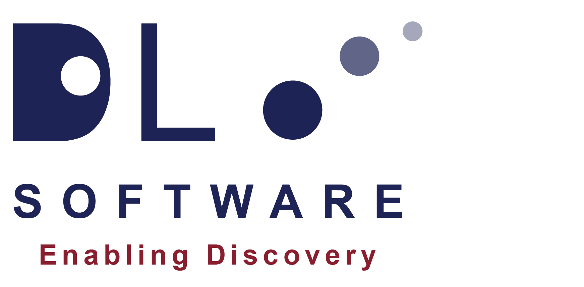

# AiiDAlab DL_POLY Application

[](https://github.com/stfc/aiidalab-dlpoly/releases)
[](https://pypi.org/project/aiidalab-dlpoly/)

[](https://github.com/stfc/aiidalab-dlpoly/actions)
[](https://stfc.github.io/aiidalab-dlpoly/)

<p align="center">
    
</p>

This is an AiiDAlab application plugin for running and managing
[DL_POLY](https://www.scd.stfc.ac.uk/Pages/DL_POLY.aspx) molecular dynamics
simulations, maintained by the [Ada Lovelace Centre](https://adalovelacecentre.ac.uk/) (ALC).
It provides a guided, wizard-style interface for configuring, submitting and
inspecting DL_POLY calculations from within the AiiDA/AiiDAlab environment,
building on the [aiida-dlpoly](https://github.com/stfc/aiida-dlpoly) plugin
which supplies the underlying AiiDA calculation and parser.

The app is still in an early development stage and any input or contributions are
welcome. Full documentation can be found at
[https://stfc.github.io/aiidalab-dlpoly/](https://stfc.github.io/aiidalab-dlpoly/).

## Features

The application guides the user through a molecular dynamics calculation as a
sequence of wizard steps:

- **Select Structure** — provide the simulation cell either by uploading a
  DL_POLY `CONFIG` file or by querying an existing structure from the AiiDA
  database, with an integrated structure viewer.
- **Configure Workflow** — supply the force field (`FIELD`) file, either by
  upload or by searching the AiiDA database, and define the simulation control
  either as a pre-formatted DL_POLY `CONTROL` file or through basic control
  parameters. Note: Some DL_POLY features are only available through a pre-configured
  `CONTROL` file.
- **Configure Computational Resources** — select the registered DL_POLY code and
  set the resources (e.g. number of CPUs) for the run.
- **Results** — browse the submitted process, its provenance and outputs through
  an interactive node tree and viewer.

A dedicated **history** page lists previously submitted DL_POLY calculations, and
a **resources** page provides computational resource setup.

## Usage

This plugin is hosted on the AiiDAlab plugin registry and can therefore be
installed via the AiiDAlab plugin management UI page from within the AiiDAlab
application interface. Instructions for how to run AiiDAlab itself can be found in
its [documentation](https://aiidalab.readthedocs.io/en/latest/usage/access/index.html)
and are also included in the documentation associated with this project at
[https://stfc.github.io/aiidalab-dlpoly/](https://stfc.github.io/aiidalab-dlpoly/).
It is generally recommended to run AiiDAlab through a container engine such as
Docker or Apptainer. In general the core docker image applicable to most use
cases is [aiidalab/full-stack:latest](https://hub.docker.com/r/aiidalab/full-stack),
however many other options exist for more tailored startup environments.

Once installed in an AiiDAlab environment, the app appears on the AiiDAlab home
page. Launch it to open `main.ipynb` and step through the wizard.

Alternatively, the package can be installed directly from source for development:

```bash
pip install .
```

## For Developers

### Style Checking

This package uses [pre-commit](https://pre-commit.com/) hooks (running
[Ruff](https://docs.astral.sh/ruff/) for linting and formatting) to enforce a
consistent style. Install the development dependencies,

```sh
pip install .[dev]
```

then enable the hooks in the repository root,

```sh
pre-commit install
```

Style and formatting checks will now run on every commit.

### Testing

This package uses [pytest](https://docs.pytest.org/en/stable/) for its unit
tests, included in the `[dev]` optional dependencies. From the project root the
tests, together with a coverage report, can be run via,

```sh
pytest --cov=aiidalab_dlpoly
```

The CI workflows are configured to ensure all tests pass before a pull request
can be accepted into the main repository. It is important that any new additions
to the code base are accompanied by appropriate testing, maintaining a high code
coverage.

### Documentation

The documentation, including a User Guide and an API reference, is built using
[Sphinx](https://www.sphinx-doc.org/). The source is contained in the `docs/`
directory. All required packages can be installed alongside the core package via,

```sh
pip install .[docs]
```

and the documentation can then be built with,

```sh
sphinx-build -b html docs/source/ docs/build/html
```

from the root directory.

See [CONTRIBUTING](CONTRIBUTING) and [CODING_STYLE](CODING_STYLE) for further
guidance on contributing to the project.

## Citation

If you use this software, please cite it as described in the
[CITATION.cff](CITATION.cff) file.

## License

[BSD 3-Clause License](LICENSE)

## Author

Dr. Benjamin T. Speake ([ORCID: 0000-0002-5690-9470](https://orcid.org/0000-0002-5690-9470)).

## Funding

Contributors to this project were funded by the
[Ada Lovelace Centre](https://adalovelacecentre.ac.uk/) (ALC).
